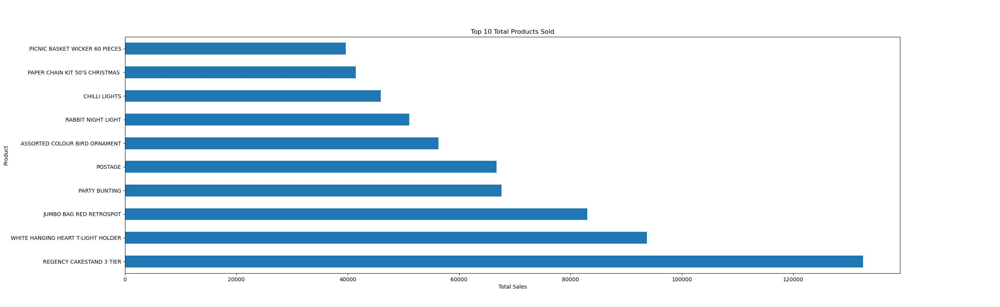
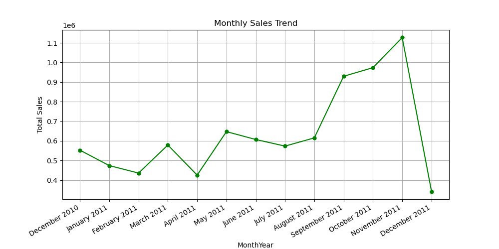
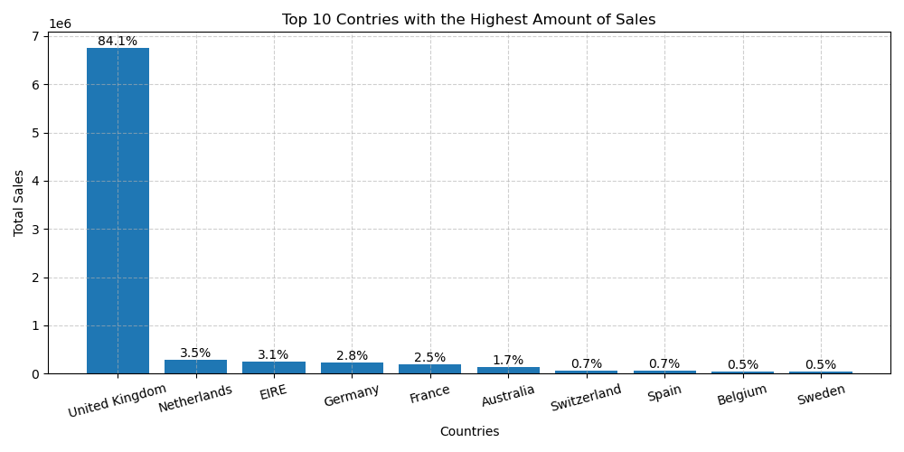

# Online Retail Exploratory Data Analysis (EDA)

## Project Overview
This project involves conducting an exploratory data analysis (EDA) on transactional data from an online retail store. The dataset contains customer purchases, including product details, quantities, prices, and timestamps. The primary goal is to uncover insights into the store's sales trends, customer behavior, and popular products. The findings from this analysis can inform strategic business decisions and enhance overall store performance.

## Table of Contents
- [Prerequisites](#prerequisites)
- [Dataset](#dataset)
- [Project Objectives](#project-objectives)
- [Steps in the Analysis](#steps-in-the-analysis)
  - [1. Load the Data](#1-load-the-data)
  - [2. Data Cleaning](#2-data-cleaning)
  - [3. Statistical Summary](#3-statistical-summary)
  - [4. Top-selling Products and Countries](#4-top-selling-products-and-countries)
  - [5. Sales Trends Over Time](#5-sales-trends-over-time)
- [Results](#results)
- [Outliers and Recommendations](#outliers-and-recommendations)
- [Conclusion](#conclusion)
- [Author](#author)

## Prerequisites
The following Python packages are required to run the analysis:
- `pandas`: For data manipulation and analysis.
- `numpy`: For numerical computing and array operations.
- `matplotlib`: For creating static, animated, and interactive visualizations.
- `seaborn`: For creating advanced statistical visualizations.
- `plotly.express`: For creating interactive web-based visualizations.
- `scipy`: For advanced scientific computing algorithms (z-score).

## Dataset
The dataset used in this analysis consists of transactional data from an online retail store, covering the period from 2010 to 2011. The dataset includes the following columns:
- `InvoiceNo`: Invoice number of the transaction.
- `StockCode`: Unique code of the product.
- `Description`: Description of the product.
- `Quantity`: Quantity of the product in the transaction.
- `InvoiceDate`: Date and time of the transaction.
- `UnitPrice`: Unit price of the product.
- `CustomerID`: Unique identifier of the customer.
- `Country`: Country where the transaction occurred.

## Project Objectives
- Describe the data to answer key questions and uncover insights.
- Gain valuable insights that can help improve online retail performance.
- Provide analytic insights and data-driven recommendations.

## Steps in the Analysis

### 1. Load the Data
The data was loaded using pandas, and the first few rows were displayed to gain an initial understanding of the dataset. The data types of each column were also examined.

### 2. Data Cleaning
This step involved addressing missing values and removing duplicates from the dataset. Missing values were dropped, resulting in a cleaned DataFrame ready for analysis.

### 3. Statistical Summary
A concise overview of the data's central tendency and spread was obtained using the `df.describe()` method. The summary helped identify outliers and potential issues in the data, such as negative quantities and sales.

### 4. Top-selling Products and Countries
The analysis focused on identifying the top-selling products and countries by sales. Various visualizations, such as bar charts, were used to highlight the most valuable products and the countries with the highest sales.

### 5. Sales Trends Over Time
Sales trends were analyzed on a monthly and daily basis. New columns were created to extract the month and day of the week from the `InvoiceDate` column. Line charts and other visualizations were used to identify the busiest sales periods.

## Results
### Top-selling Products

This bar chart shows which products are generating the most sales.

### Sales Trends Over Time

This line chart illustrates how sales vary over time, helping to identify patterns or trends.

### Top-selling Countries

This bar chart highlights the geographic distribution of sales, useful for understanding market performance.

### Sales Distribution

This histogram shows the distribution of sales values.

## Outliers and Recommendations
- **Outliers**: Outliers were identified using statistical methods, such as the z-score. Some identified outliers include transactions with extremely high quantities or unit prices. However, considering the data's context and analysis goals, removing all outliers might not be appropriate because these valid entries might hold valuable information and impact overall analysis.

- **Recommendations**:
  - **Inventory Management**: Focus on maintaining stock levels for top-selling products to avoid stockouts and maximize sales.
  - **Marketing Campaigns**: Tailor marketing strategies to high-performing countries and peak sales periods to optimize impact.
  - **Sales Optimization**: Consider special promotions or discounts during off-peak times to boost sales and manage inventory more effectively.

## Conclusion
The exploratory data analysis provided valuable insights into the online retail store's performance. The findings can guide strategic business decisions, such as inventory management, marketing campaigns, and customer targeting. The analysis also highlighted areas for improvement, such as handling returns and optimizing sales during off-peak periods.

## Author
This project was conducted by [6as]. For any questions or feedback, feel free to reach out via email at [6as.com].
